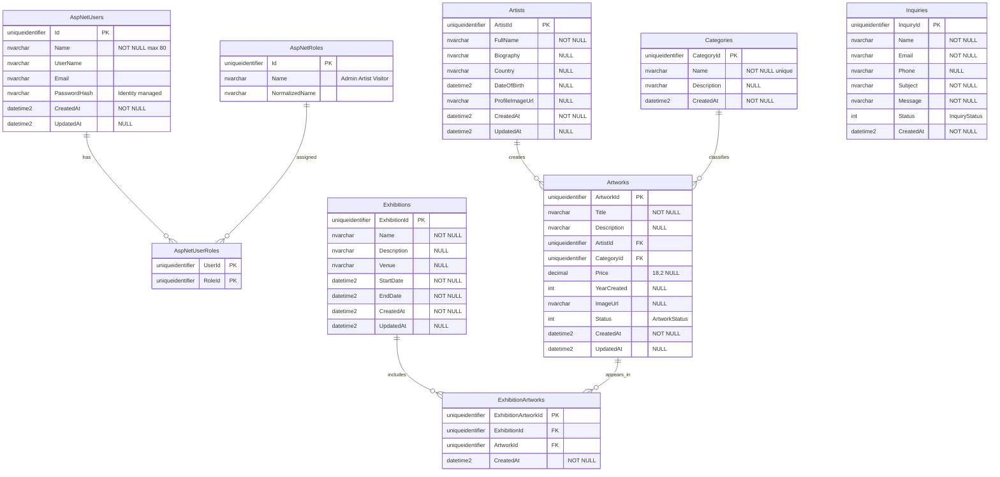

# Entity Relationship Diagram — Art Gallery Management System

## Overview

SQL Server database structure for the Art Gallery Management System.

| Category | Tables |
| --- | --- |
| Implemented (Identity) | `AspNetUsers`, `AspNetRoles`, `AspNetUserRoles`, plus supporting Identity tables |
| Planned (core modules) | `Artists`, `Categories`, `Artworks`, `Exhibitions`, `ExhibitionArtworks`, `Inquiries` |

**Important note:** Authentication and role management use **ASP.NET Core Identity**. Internal Identity tables are not fully drawn in the academic ER diagram. Roles are stored in `AspNetRoles` / `AspNetUserRoles` — **not** as a `Role` column on the users table.

Rendered image: [`art-gallery-er-diagram.png`](./art-gallery-er-diagram.png)

---

## Mermaid ER Diagram (academic view)

---

## Table descriptions

### AspNetUsers (ApplicationUser storage)

Implemented. Custom columns: `Name`, `CreatedAt`, `UpdatedAt`. Other columns come from ASP.NET Core Identity. There is **no** `Role` string column.

### AspNetRoles / AspNetUserRoles

Implemented. Store Admin, Artist, Visitor. Documented for authentication clarity; full Identity claim/login/token tables exist in `001_CreateAuthTables.sql`.

### Artists, Categories, Artworks, Exhibitions, ExhibitionArtworks, Inquiries

Planned core business tables for the MCA project modules. See Data Dictionary for full field definitions.

---

## Relationships and cardinality

| Relationship | Cardinality | Foreign key |
| --- | --- | --- |
| Artists → Artworks | 1 → 0..\* | `Artworks.ArtistId` |
| Categories → Artworks | 1 → 0..\* | `Artworks.CategoryId` |
| Exhibitions → ExhibitionArtworks | 1 → 0..\* | `ExhibitionArtworks.ExhibitionId` |
| Artworks → ExhibitionArtworks | 1 → 0..\* | `ExhibitionArtworks.ArtworkId` |
| AspNetUsers ↔ AspNetRoles | many-to-many | via `AspNetUserRoles` |

Exhibition ↔ Artwork is many-to-many through `ExhibitionArtworks` with unique `(ExhibitionId, ArtworkId)`.

`Inquiries` has no FK to users (anonymous contact).

---

## Corrections applied (review)

1. Removed incorrect `Role` column from the users table representation.
2. Documented `AspNetRoles` and `AspNetUserRoles` as the real role model.
3. PK for users is `Id` (matches Identity / SQL script).
4. Planned business tables remain in scope for the complete project blueprint.
